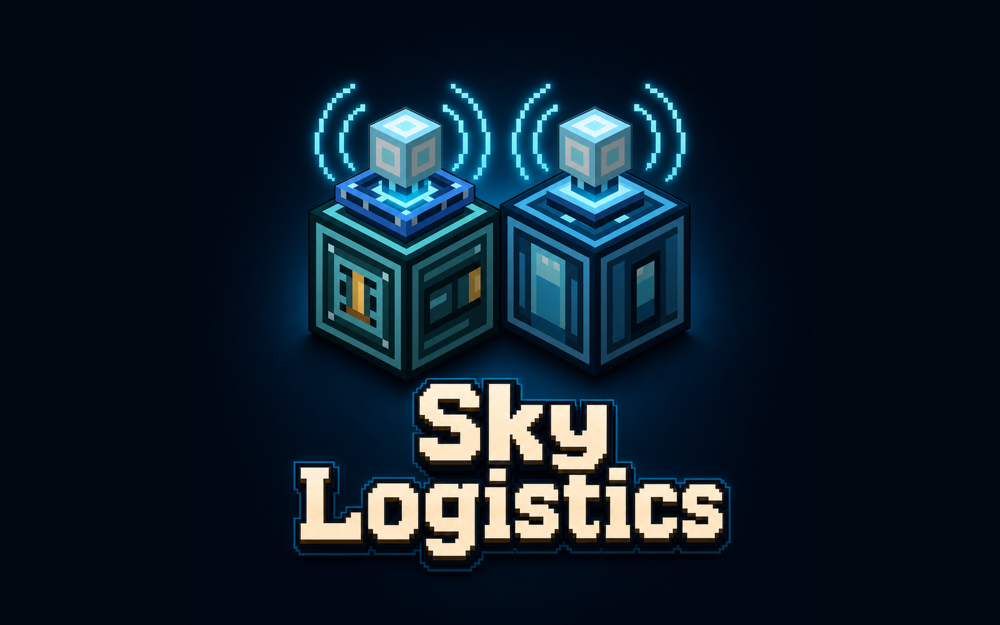

# Sky Logistics / 天穹物流



**其他语言版本： [English](README.md)**

为 Minecraft 提供天穹主题的物流系统。天穹物流通过命名无线线路或轻量本地管道搬运物品、流体、能量及受支持的第三方资源，提供聚合型大型仓储，并包含用于线路配置、资源过滤、随身转运和高空供奉配方的完整工具链。

## 文档

- **[玩家 Wiki](https://github.com/AmicBeam/sky-logistics/wiki)**：快速入门、完整物品/方块图鉴、物流与供奉系统、联动、配置和故障排查。
- Wiki 的 Git 源文件维护在 [`wiki/`](wiki/README.md)。

## 功能亮点

- **性能优先设计**：传输使用操作预算、就绪线路队列、热槽追踪、能力缓存和端点退避，减少无效扫描，让大型网络也能保持响应。
- **无线物流**：通过命名物流线路连接机器、仓库和外部存储接口，无需铺设实体管道；物品、流体和能量共用同一套线路模型，一个机器面可同时传输多种资源，并可通过维度升级在已加载维度间传输。
- **简易本地管道**：配方便宜的物品、流体和能量管道会自动连接相邻兼容容器及同类管道，组成有规模上限的本地线路，无需设置线路、打开 GUI，也没有隐藏缓存。
- **快速铺设与调整**：普通放置会在点击的容器侧创建存入端，潜行放置则创建抽取端；天穹配置器可切换管道端点的抽取与存入模式，天穹扳手及兼容扳手可断开或重新连接单独一侧。
- **高吞吐量**：普通节点每 tick 扫描 1 个槽位，每张堆叠的速度升级额外增加 1 个；默认一个升级格最多放 8 张，可达到 9 槽/t。标准物品与 FE 操作采用可配置的 2.1G 级上限，两端均支持 long 数量时，直连单次操作上限可配置至约 9.22e18。简易管道每个抽取端默认每 tick 可搬运 64 个物品、10,000 mB 流体、100,000 FE、10,000 化学品、50 mana 或 50 Source。
- **多容器一键连接**：天穹分配器允许一个物流节点或简易管道代理一组相连的兼容容器。输入默认会在可接收目标间尽量均分；接收到红石信号时则改为按游标顺序依次存放。抽取会聚合所有目标；默认最多代理 16 个目标，可配置至 64 个。
- **自带高堆叠仓储**：天穹物品库和天穹流体库按类型聚合存储，单类型可容纳约 9.22e18 单位，并提供可搜索的终端式界面；类型上限可扩展、可配置。
- **物品栏与背包交互**：天穹项链提供抽取、存入和维持三种模式，可在物流线路、玩家物品栏和支持的 Sophisticated Backpacks 库存之间转运物品；维持目标可直接输入，并在物品数量与槽位数量间切换。
- **化学品过滤**：在支持 Mekanism 的版本中，可从 JEI 将化学品拖入普通过滤列表，规则会同时作用于化学品传输的来源端和目标端。
- **模组联动**：与 Jade、JEI、Patchouli、Curios、Sophisticated Backpacks、Mekanism、植物魔法和新生魔艺等提供可选且可配置的兼容；在模组版本及 API 兼容时，专用接口可将天穹线路接入 AE2、Refined Storage 和 Beyond Dimensions 网络。
- **扩展资源**：Mekanism 化学品与 1.21.1 的坚守者灵魂走流体面和流体管道，并拥有独立限速；植物魔法 mana 与新生魔艺 Source 走能量面和能量管道。扩展资源只在同类处理器之间搬运。
- **AStages 进度联动**：Minecraft 1.20.1 与 1.21.1 可按线路持有者拥有的 stage 限制并逐步解锁单次搬运量；该联动需要 AStages 2.x，且默认关闭。

## 依赖

本仓库在同一个分支中维护多个 Minecraft 版本。每个版本目录都可以独立构建。

- **Forge（Minecraft 1.20.1）**：使用 `versions/1.20.1`
  - Minecraft 1.20.1
  - Forge 47.x
  - Mekanism 10.4+（可选）
  - Botania / 植物魔法 1.20.1（可选）
  - Ars Nouveau / 新生魔艺 4.x（可选）
  - AStages 2.x（可选，默认关闭）
  - AE2 15.2+（可选）
  - Refined Storage 1.12+（可选）
  - Beyond Dimensions 0.7.5+（可选）
  - Jade 11.x / JEI 15.x API jar 可用于编译对应的可选兼容源码
- **NeoForge（Minecraft 1.21.1）**：使用 `versions/1.21.1`
  - Minecraft 1.21.x
  - NeoForge 21.1+
  - Jade 15+（可选）
  - JEI 19+（可选，客户端）
  - Patchouli 1+（可选）
  - Mekanism 10.7+（可选）
  - Ars Nouveau / 新生魔艺 5.x（可选）
  - Curios 9+（可选）
  - Sophisticated Backpacks 3.25+（可选）
  - AStages 2.x（可选，默认关闭）
  - AE2 19+（可选）
  - Industrial Foregoing: Souls 1.10.3+ 与 Soulplied Energistics 1.0.3+（可选，坚守者灵魂运输）
  - AppliedSoul（可选，AE 坚守者灵魂存储元件；复用 Soulplied Energistics 的 Soul Key）
  - Refined Storage 2+（可选）
  - Beyond Dimensions 0.7.6+（可选）
- **NeoForge（Minecraft 26.1.2）**：使用 `versions/26.1.2`
  - Minecraft 26.1.2
  - NeoForge 26.1.2.71+
  - Java 25
  - Jade、JEI、Mekanism、植物魔法、新生魔艺、AE2、Refined Storage 和 Beyond Dimensions 联动均为可选，仅在存在兼容 API 时启用
  - 此版本不支持 AStages

## 安装

1. 将与你的 Minecraft/加载器版本匹配的天穹物流 jar 放入 `mods` 文件夹
2. 按需安装想要使用的可选联动 Mod
3. 启动游戏

## 使用方法

1. 前期可直接合成简易物品、流体或能量管道，搭建低成本物流网络；普通放置在点击的容器侧创建存入端，潜行放置则创建抽取端。
2. 使用天穹配置器切换面向机器的管道端点模式；使用天穹扳手或其他兼容扳手断开、重新连接管道侧面。
3. 默认在 Y 200 以上或配置的供奉高度为尤洛伽水晶充能，并用它制作天穹石和高级天穹物流组件。
4. 搭建带供桌的多方块天穹供奉祭坛，用于制作柯拉甘露和其他供奉产物。
5. 放置天穹物品库或天穹流体库，作为聚合仓储端点。
6. 将天穹物流节点放在机器、仓库、分配器或外部存储接口旁；普通放置为存入模式，潜行放置为抽取模式。
7. 使用天穹配置器创建和管理命名线路、复制粘贴节点设置，并通过副手为新放置节点预设配置。
8. 按需加入过滤列表、标签过滤列表、速度升级和维度升级。
9. 给天穹项链放入白名单过滤列表，即可在物流线路与玩家物品栏或受支持背包间抽取、存入或维持物品数量。
10. 安装对应联动模组，即可将天穹线路直接接入 AE2、Refined Storage 或 Beyond Dimensions 网络；具体资源路径取决于模组版本与已安装附属。

## 说明

- 无线物流节点会直接配对同一命名线路中已加载的抽取面和存入面；简易管道则提供独立的逐格本地运输方式，只与相邻同类管道组成有上限的线路。
- 线路没有隐藏的物品/流体/能量缓存。目标无法接收时，源端不会先被抽空。
- 简易管道没有 GUI，启用后始终工作；其线路复用物流节点传输引擎，并有独立的各资源限速。单条线路默认最多包含 1024 个管道方块。
- 天穹分配器是只供本模组物流节点和简易管道使用的无缓存路由代理；原版漏斗和第三方管道不能把它当作普通物品栏或储罐连接。
- Mekanism 化学品走流体开关；植物魔法 mana 和新生魔艺 Source 魔源走能量开关，但只会搬到同类资源处理器，不会转换为 FE。
- 9.22e18 级直连要求两端都支持 long 数量；这是单次操作上限，不是保证达到的每 tick 吞吐率。
- 显示名对应的线路 id 是稳定的；不改名或复用同名线路时，会继续指向同一条线路。
- 节点传输使用预算、缓存、就绪线路队列、热槽追踪、能力缓存和端点退避来控制性能开销。
- 天穹项链的工作间隔可通过服务端配置 `skyNecklaceTickInterval` 调整，默认 10 tick；`skyNecklaceTargetAttemptsPerWork` 限制每次工作访问的输出端点数，默认 1。
- 仓库类型上限、节点物品/能量单次传输量、天穹容器间直连传输量、分配器目标数与操作预算、热槽缓存大小、供奉高度和水晶充能时间均可配置。
- 简易管道配置集中在 `transfers.simplePipes` 分类；其中各资源的 `...TransferRate` 可独立限速，`simplePipeMaxConnectedBlocks` 控制单条线路规模，`enforceSimplePipeConnectionLimit` 可关闭上限检查。简易管道固定使用钻石配方。
- AStages 控制单次操作上限，而不是操作频率；它不会提高速度升级速率或服务器、线路的每 tick 操作预算。
- Patchouli 支持为纯数据内容，安装 Patchouli 后会显示指南书内容。
- 可选联动仅在检测到对应 Mod 且版本/API 兼容时启用。

## 构建

在仓库根目录构建三个支持版本：

```bash
./scripts/build_all_versions.sh
```

单独构建一个版本：

```bash
cd versions/1.21.1
./gradlew --no-daemon clean build

cd ../1.20.1
./gradlew --no-daemon clean build

cd ../26.1.2
./gradlew --no-daemon clean build
```

`common` 目录存放所有支持版本共享的源码和资源。Forge、NeoForge、映射、依赖和 API 相关代码保留在 `versions/<minecraft-version>` 下。

## 许可证

MIT，见各版本目录中的 `LICENSE` 文件。
