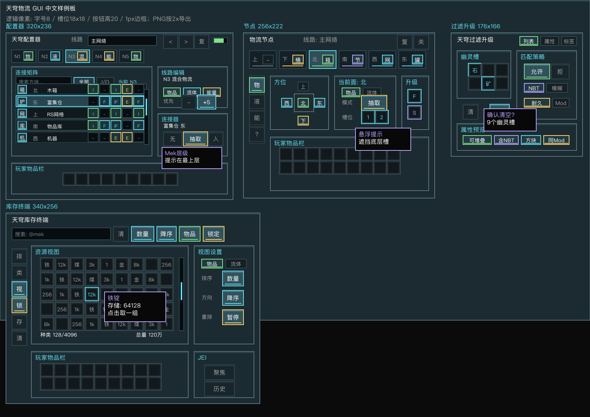
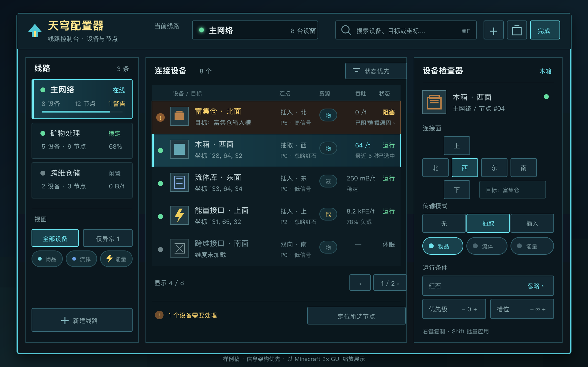

# Sky Logistics GUI Redesign

本文是 `0.0.1` 之后的 GUI 重设计规格。当前状态：这是目标设计、调研结论、草图样例和验收稿，不代表所有界面已经进入代码实现。

## 当前状态

已进入代码的部分：

- 物流节点已有每面模式：`NONE`、`INPUT`、`OUTPUT`。
- 物流节点已有每面资源开关：物品、流体、能量。
- 物流节点已有每面红石控制、优先级、物品槽位限制。
- 物流节点已有升级槽，但当前三个版本代码中 `UPGRADE_SLOTS = 2`，不是 4。
- 过滤列表已改为可见名称“天穹过滤升级”，并保留独立 GUI。
- 速度升级卡已控制节点速率：`1 堆叠/t -> 2 堆叠/t`。
- 配置器已有线路翻页、线路统计、线路详情同步包。
- 物品库和流体库已有搜索、排序、滚动网格和客户端缓存视图。

尚未完整进入代码的部分：

- 配置器的宽屏线路仪表盘、可扫描设备列表、空线路删除状态展示。
- 物流节点的最终版六面标签页、紧凑面详情、升级区布局。
- Create 风格过滤升级新版布局，以及属性过滤模式。
- AE2/RS 风格终端的动态行数、左侧工具栏、排序方向、视图锁定。
- 通用 GUI 元素层：统一按钮、分段控件、滚动条、tooltip、资源格渲染。

## 本轮样例约束

不新增按钮、不新增一级入口、不把现有界面改成新控制台。样例只在当前代码已有的控件基础上调整视觉层次、按钮样式、内容分组和显示文案。

从 AE2、Mek 等大型模组保留的经验只落到“显示质量”上：

- 终端保留现有搜索框、排序按钮和 4x9 资源网格，只强化搜索区、资源区、统计区和玩家物品栏的层次。
- 配置器保留现有线路翻页、线路名、线路详情、资源、红石、槽位限制和优先级控件，只整理详情列表和控制行的视觉分组。
- 物流节点保留现有六面按钮、资源开关、模式按钮、升级槽和“更多/基础”切换，只让当前面、选中态和禁用态更清楚。
- 过滤升级保留现有幽灵槽、三组分段按钮和清空按钮，只给按钮组增加更明确的状态色、分组标签和 tooltip 呈现。

## UI 样式图片

以下样例图使用中文界面文案，并按现有 Screen 逻辑尺寸绘制后 2x 导出，便于文档查看。尺寸基准：文字 8px、槽位 18x18、现有按钮高度 18/20px、边框 1px。

总览图：



单屏落地图：

- [配置器现有布局优化](gui-mockups/configurator-dashboard.png)
- [配置器宽屏工作台改版样例](gui-mockups/configurator-workbench-concept.png)
- [物流节点现有布局优化](gui-mockups/node-face-config.png)
- [过滤升级现有布局优化](gui-mockups/filter-upgrade-modes.png)
- [库存终端现有布局优化](gui-mockups/vault-terminal.png)

### 配置器宽屏工作台样例

这一版允许完全抛弃当前纵向表单，目标不是“把按钮重新排漂亮”，而是把配置器变成适合持续运维线路的工作台：



- 左栏是线路导航，并保留在线、闲置、警告和设备规模等可扫描状态。
- 中栏是设备表，默认把异常设备置顶，同时展示目标、连接面、资源类型、最近吞吐和运行状态。
- 右栏是所选设备的检查器；六面、模式、资源、红石、优先级和槽位限制不再占用全局空间。
- 搜索、仅异常视图、定位节点和批量应用都围绕“快速发现问题并连续修改”设计。
- 该样例是目标信息架构，不受当前 `254 x 244` 布局和现有按钮数量限制。

## 调研结论

### 推荐方案

不建议直接引入 AE2、RS、Mekanism、XNet 或 LaserIO 的 GUI 框架。推荐保留当前 `AbstractContainerScreen` / `AbstractContainerMenu` 体系，在 `common` 中抽一层轻量 Sky Logistics GUI 组件。

原因：

- AE2 和 RS 的终端体验非常适合借鉴，但它们绑定自身存储模型、样式系统和网络包。
- Mekanism 的 `GuiElement` / window / tooltip 分层很成熟，但整体框架重量偏大，引入成本高。
- XNet 使用 McJtyLib 的声明式 GUI，适合 XNet 自身生态，不适合作为本项目依赖。
- LaserIO 更接近本项目的节点配置体验，但它的按钮和保存策略偏即时手写，适合借鉴布局，不适合照搬。
- Create 的过滤器交互非常适合玩家学习，但普通过滤器和属性过滤器是两个物品。天穹物流应保留一个升级物品，用内部模式切换承载两套行为。

### 目标架构

建议新增轻量客户端组件包：

```text
com.skylogistics.client.gui
  SkyGuiTheme              颜色、间距、槽背景、面板绘制
  SkyGuiElement            可 tick、可 tooltip、可阻挡槽点击的基础接口
  SkyIconButton            16x16 / 18x18 图标按钮
  SkySegmentButton         分段控件按钮
  SkyScrollbar             资源视图和详情列表共用滚动条
  SkyResourceGrid<T>       物品库/流体库资源网格
  SkyResourceView<T>       backing map/list + filtered view list
  SkyTooltip               多行 tooltip 组装
```

这个组件层只负责渲染和交互，不持有游戏逻辑。服务端状态仍由 `Menu`、`DataSlot`、同步包、方块实体 NBT 和网络注册表提供。

## 参考模组与转化

### Applied Energistics 2

参考源码：

- `appeng/client/gui/me/common/MEStorageScreen.java`
- `appeng/client/gui/me/common/Repo.java`
- `appeng/client/gui/widgets/Scrollbar.java`
- `appeng/client/gui/widgets/SettingToggleButton.java`

借鉴点：

- 终端屏幕按可用高度动态决定资源行数。
- `Repo` 在客户端维护服务端存储副本，并生成当前 view。
- 搜索、类型过滤、排序、滚动条和实际存储解耦。
- 按住 Shift 时暂停重排，避免高频更新导致鼠标下资源跳动误点。
- 左侧工具栏承载排序、视图模式、类型过滤、终端设置。

对天穹物流的转化：

- 物品库/流体库抽出 `SkyResourceView<T>`，保留真实快照和当前视图两层数据。
- 搜索和排序只作用于 view list，不直接遍历/修改方块实体存储。
- 资源数量变化时先更新条目；排序锁定或按键暂停时只改数量，不重排。
- 终端高度应支持小/中/大/拉伸四档，默认 5 行，屏幕足够高时可扩到 8 行。

### Refined Storage

参考源码：

- `com/refinedmods/refinedstorage/screen/grid/GridScreen.java`
- `com/refinedmods/refinedstorage/screen/grid/view/GridViewImpl.java`
- `com/refinedmods/refinedstorage/screen/widget/SearchWidget.java`
- `com/refinedmods/refinedstorage/screen/widget/sidebutton/*`

借鉴点：

- `GridViewImpl` 使用 backing map + sorted filtered list。
- delta 包可以局部更新资源，并用二分插入保持排序。
- 搜索框有历史、右键清空、快捷键聚焦、JEI 双向同步。
- 侧边按钮表示排序方向、排序类型、网格大小、视图类型。
- 点击资源网格和点击玩家背包有不同网络包，交互语义很清晰。

对天穹物流的转化：

- `ItemVaultScreen` 与 `FluidVaultScreen` 应共用终端基类，只保留渲染与点击包的类型差异。
- 搜索框至少支持：右键清空、Enter 失焦、Esc 先失焦再关闭、历史上/下切换。
- 排序类型和排序方向拆成两个按钮，避免一个按钮循环过多状态。
- 物品与流体终端都应提供“固定排序”开关，资源变化时只刷新数量。

### Mekanism

参考源码：

- `mekanism/client/gui/GuiMekanism.java`
- `mekanism/client/gui/element/GuiElement.java`
- `mekanism/client/gui/element/window/GuiWindow.java`
- `mekanism/common/tile/interfaces/ISideConfiguration.java`

借鉴点：

- GUI 元素有生命周期：初始化、tick、背景、前景、tooltip。
- window/overlay 按层级渲染，tooltip 始终在最高层。
- 虚拟槽位和窗口会阻挡原版槽点击，避免点到覆盖层后面的槽。
- widget 可以保存持久状态，屏幕重建时恢复焦点和位置。
- side configuration 把资源类型、槽位、方向配置拆成清晰的数据模型。

对天穹物流的转化：

- 不引入 Mekanism 的完整 GUI 框架，只借鉴元素生命周期。
- `SkyGuiElement` 应提供 `tick()`、`renderBg()`、`renderFg()`、`renderTooltip()`、`blocksSlotClick()`。
- 有弹窗时，弹窗下方的槽和按钮不能响应点击。
- 删除线路确认、过滤器清空确认可以做成轻量 modal，而不是聊天提示。
- 节点面配置使用本项目已有 `FaceConfig` 概念，不把红石、优先级和过滤塞成一坨 NBT 临时状态。

### XNet

参考源码：

- `mcjty/xnet/modules/controller/client/GuiController.java`
- `ChannelEditorPanel.java`
- `ConnectorEditorPanel.java`
- `assets/xnet/gui/controller.gui`

借鉴点：

- 一个控制界面管理多通道、多连接器，而不是逐个方块重复右键。
- 左侧是连接器列表，中间/顶部是通道选择，右侧是当前通道和当前连接器编辑器。
- 连接器列表按设备显示图标、方向、通道状态。
- 支持搜索设备、复制/粘贴通道配置、双击高亮设备。

对天穹物流的转化：

- 配置器是线路仪表盘，不是简单物品开关页。
- 线路详情列表显示节点、面、目标设备、资源状态、红石、优先级。
- 后续可加入“复制当前面配置”“粘贴到同线路所有面”。
- 不使用 XNet 的 McJtyLib `.gui` DSL，避免增加大依赖。

### LaserIO

参考源码：

- `com/direwolf20/laserio/client/screens/LaserNodeScreen.java`
- `CardItemScreen.java`
- `widgets/IconButton.java`
- `UpdateCardPayload.java`

借鉴点：

- 节点界面用六个方向标签快速切换面。
- 每个方向可显示相邻方块图标，玩家能立即识别在配置哪个设备。
- 卡片界面以图标按钮为主，tooltip 解释状态。
- 模式变化后动态显示/隐藏相关控件。

对天穹物流的转化：

- 节点 GUI 顶部使用六面标签页：方向简称、目标图标、模式色条。
- 当前面详情区只显示与当前模式有关的资源开关和高级项。
- 节点升级槽只显示物品图标和短标签，不显示长说明。
- 配置保存使用本项目现有即时 `MenuAction`，不采用 LaserIO 关闭屏幕时统一保存的策略。

### Create

参考源码：

- `AbstractFilterScreen.java`
- `FilterScreen.java`
- `AttributeFilterScreen.java`
- `FilterScreenPacket.java`

借鉴点：

- 过滤器是独立物品 GUI，玩家知道“先配置过滤器，再装到机器里”。
- 普通过滤和属性过滤拆成不同交互，不把所有选项挤在一个页面。
- 图标按钮 + Shift tooltip 解释高级行为。
- ghost item 和清空包独立，交互清晰。

对天穹物流的转化：

- 保留一个“天穹过滤升级”物品，内部有“列表模式”和“属性模式”两个页面。
- 列表模式继续使用幽灵物品/流体槽。
- 属性模式使用芯片按钮，不显示物品槽。
- 同一过滤升级可被节点、项链或后续接口复用。

## 统一交互原则

- 图标优先，文字保留在标题、状态和值上。
- 所有图标按钮必须有 tooltip；复杂按钮支持 Shift 展示更长说明。
- 所有状态按钮都要有即时视觉反馈：客户端先乐观更新，服务端确认后修正。
- 搜索框右键清空；Enter 失焦；Esc 第一次失焦，第二次关闭。
- 删除操作必须有确认：删除线路、清空过滤器、清空终端搜索历史。
- `粘贴模式` 不在配置器 GUI 中显示 ON/OFF，因为打开配置器 GUI 会退出粘贴模式。
- 线路列表默认只显示玩家自己的线路；共享线路以后另开权限模型。
- 删除线路只允许删除空线路：没有节点、没有项链、没有外部设备接入、没有缓存线路活动。
- 节点 GUI 不显示过滤摘要、速率说明、教程句。说明进入手册或 tooltip。
- 终端资源变化频繁时避免重排抖动；按住 Shift 或开启排序锁定时暂停重排。

## 通用按钮规范

| 功能 | 临时文本/符号 | 最终图标建议 | 尺寸 | tooltip |
| --- | --- | --- | --- | --- |
| 第一条线路 | `|<` | 双左箭头带竖线 | 18x18 | 返回第一条线路 |
| 上一条线路 | `<` | 左箭头 | 18x18 | 上一条线路 |
| 下一条或新建 | `>+` | 右箭头加号 | 22x18 | 下一条线路；末尾时创建 |
| 最后一条线路 | `>|` | 双右箭头带竖线 | 18x18 | 跳到最后一条线路 |
| 删除空线路 | `x` | 垃圾桶或叉号 | 18x18 | 删除当前空线路 |
| 搜索清空 | `x` | 小叉号 | 14x14 | 清空搜索 |
| 排序锁定 | `L` | 锁 | 18x18 | 锁定当前排序 |
| 物品资源 | `I` | 物品格 | 20x20 | 启用/禁用物品 |
| 流体资源 | `F` | 水滴 | 20x20 | 启用/禁用流体 |
| 能量资源 | `E` | 闪电 | 20x20 | 启用/禁用能量 |
| 自动探测 | `A` | 魔杖或雷达 | 20x20 | 按目标能力自动启用资源 |
| 红石控制 | `R` | 红石粉 | 22x18 | 循环红石模式 |
| 高级面板 | `...` | 齿轮 | 22x18 | 显示高级面配置 |

按钮状态：

- 普通：深色描边，浅色图标。
- hover：边框高亮。
- selected：内部低透明填充 + 底部 2px 色条。
- disabled：降低亮度，tooltip 说明不可用原因。
- danger：删除/清空使用红色底部色条。

## 天穹配置器

### 目标布局

尺寸建议：`360 x 232`。该屏幕是线路仪表盘，优先展示线路状态和设备列表。

```text
+--------------------------------------------------------------------------------+
| Sky Configurator        Line: Main Network                 [|<][<][>+][>|][x] |
|                         [ editable line name............. ]   #3 / 8          |
| Nodes 12   Inputs 5   Outputs 7   Items  on   Fluids on   Energy off          |
|                                                                                |
| +-- Connected devices -------------------------------------------------------+ |
| | Icon Face Mode  Target                       Type      Redstone  Priority  | |
| | [ ]  N   IN     minecraft:chest              I         Ignore    +0        | |
| | [ ]  E   OUT    mekanism:energized_smelter   I F E     High      +5        | |
| | [ ]  U   IN     skylogistics:sky_necklace    I         Ignore    -2        | |
| | [ ]  W   OUT    refinedstorage:grid          I F       Low       +0        | |
| |                                                    scrollbar [###   ]      | |
| +----------------------------------------------------------------------------+ |
| [I] [F] [E] [A]       Redstone [R Ignore]      Slot [-][∞][+] Priority[-][0][+] |
+--------------------------------------------------------------------------------+
```

### 菜单结构

```text
ConfiguratorMenu
  DataSlot lineNodes
  DataSlot lineInputs
  DataSlot lineOutputs
  DataSlot lineIndex
  DataSlot lineCount
  packet ConfiguratorLineDetailsPacket(lineId, entries)
  action line navigation
  action resource toggles
  action redstone / priority / slot limit
```

下一步建议新增：

- `lineDeletable`：`DataSlot` 或 packet 字段，避免客户端猜测删除按钮状态。
- `lineHasMoreDetails`：详情超过 64 条时显示截断状态。
- `LineSummaryPacket`：如果后续详情字段超过 `DataSlot` 能力，独立同步线路摘要。

### 线路详情行草图

```text
+------------------------------------------------------------------------------+
| [target icon] N  Extract  Chest                         [I][ ][ ]  R:Ignore  |
|              node 120,64,-32 -> target 120,64,-33       P:+0      loaded     |
+------------------------------------------------------------------------------+
```

行内元素：

- 目标图标：目标方块物品或玩家头像。
- 方向：`U D N S W E` 或中文短字。
- 模式：用色条表达，文本只在详情行中显示。
- 类型：三个小 chip，启用为高亮，禁用为灰色。
- 红石和优先级：紧凑文本。
- hover：显示维度、节点坐标、目标坐标、完整方块 ID。

## 天穹物流节点

### 目标布局

尺寸建议：`384 x 292`。节点屏幕用于配置当前节点的六个面。

```text
+--------------------------------------------------------------------------------+
| Sky Node                 Line: Main Network                 [|<][<][>+][>|][x] |
|                         [ editable line name............. ]   #3 / 8          |
|                                                                                |
| [U icon] [D icon] [N icon] [S icon] [W icon] [E icon]                         |
|  U ---    D ---    N IN     S OUT    W ---    E OUT                            |
|                                                                                |
| Current face: North -> minecraft:chest                         [gear/basic]    |
| +-- Basic -------------------------------------------------------------------+ |
| | Resources      [I selected] [F disabled] [E disabled]                       | |
| | Mode           [None] [Extract selected] [Insert]                           | |
| | Capability     Item available                                               | |
| +----------------------------------------------------------------------------+ |
| Upgrades        [slot 1] [slot 2]                         current compatible  |
|                                                                                |
| Player inventory                                                              |
| [ ][ ][ ][ ][ ][ ][ ][ ][ ]                                                    |
| [ ][ ][ ][ ][ ][ ][ ][ ][ ]                                                    |
| [ ][ ][ ][ ][ ][ ][ ][ ][ ]                                                    |
| Hotbar                                                                        |
| [ ][ ][ ][ ][ ][ ][ ][ ][ ]                                                    |
+--------------------------------------------------------------------------------+
```

高级面板：

```text
+-- Advanced ----------------------------------------------------------------+
| Redstone       [Ignore v]                                                   |
| Slot limit     [-] [unlimited] [+]                                          |
| Priority       [-10] [-] [0] [+] [+10]                                      |
| Face filter    [ghost filter upgrade]                                       |
+----------------------------------------------------------------------------+
```

如果后续需求明确升级为 4 个升级槽，节点中段可以改成下面的目标布局；这需要同步修改三个版本的 `UPGRADE_SLOTS`、槽位布局和 NBT 兼容。

```text
+-- Upgrades ----------------------------------------------------------------+
| [filter upgrade] [speed upgrade] [dimension upgrade] [empty]                |
+----------------------------------------------------------------------------+
```

### 六面标签按钮

每个面标签固定 48x34 或 42x34，不能因为文字长度改变布局。

```text
+---------+
| N  [ ]  |  顶部左侧：方向短名
| chest   |  中间：目标图标
| == IN   |  底部：模式色条
+---------+
```

状态色建议：

- `NONE`：灰色。
- `INPUT / Extract`：暖色。
- `OUTPUT / Insert`：青色。
- 当前面：描边使用 `ACCENT`。
- 无目标：整体置灰，但仍可 hover 显示“无可配置目标”。

### 菜单结构

```text
SkyNodeMenu
  selectedFace
  upgrade slots
  face filter ghost slot
  line index/count DataSlot
  actions:
    FACE_SELECT
    FACE_NONE / FACE_EXTRACT / FACE_INSERT
    TOGGLE_ITEMS / TOGGLE_FLUIDS / TOGGLE_ENERGY
    FACE_REDSTONE
    FACE_PRIORITY
    FACE_SLOT_LIMIT
    LINE_NAVIGATION
```

建议：

- 当前已有每面资源开关和模式，优先升级 UI，不需要先重写后端。
- 当前兼容布局按 `2` 个升级槽绘制；目标若升级到 `4` 个槽，必须作为单独数据迁移需求处理。

## 天穹过滤升级

### 目标布局

尺寸建议：`176 x 166`，底部接玩家背包。一个过滤升级物品，内部两种模式。

列表模式：

```text
+------------------------------------+
| Sky Filter                 [L][W][T]|
|                                    |
|          [ ][ ][ ]                 |
|          [ ][ ][ ]                 |
|          [ ][ ][ ]                 |
|                                    |
| [trash]                    [check] |
+------------------------------------+
| Player inventory                  |
+------------------------------------+
```

属性模式：

```text
+------------------------------------+
| Sky Filter                 [A][W][O]|
| Reference item: [ghost item]        |
|                                    |
| [stackable]     [has nbt]           |
| [damageable]    [damaged]           |
| [enchanted]     [food]              |
| [block item]    [fluid container]   |
|                                    |
| [trash]                    [check] |
+------------------------------------+
| Player inventory                  |
+------------------------------------+
```

顶部按钮：

| 按钮 | 列表模式含义 | 属性模式含义 |
| --- | --- | --- |
| `[L] / [A]` | 切到列表 / 属性 | 切到列表 / 属性 |
| `[W] / [B]` | 白名单 / 黑名单 | 白名单 / 黑名单 |
| `[T] / [E]` | tag / 精确 | 任一 / 全部 |

交互：

- 左键过滤槽：放入当前光标物品/流体的幽灵项。
- 右键过滤槽：清空槽。
- Shift 点击玩家物品：填入第一个空过滤槽。
- 属性模式点击芯片：启用/禁用属性。
- 清空按钮：弹出确认 modal。

### 模型建议

```text
FilterMode LIST | ATTRIBUTE
FilterLogic WHITELIST | BLACKLIST
ListMatch EXACT | TAG
AttributeMatch ANY | ALL
AttributeFlags bitset
```

NBT 兼容：

- 旧 `filter_list` 物品继续按列表模式读取。
- 未写 `FilterMode` 的旧物品默认为 `LIST`。
- 属性模式新增 tag 时不要破坏旧过滤槽 tag。

## 天穹物品库 / 天穹流体库

### 目标布局

尺寸建议：`296 x 256` 起，支持动态高度。

```text
+----------------------------------------------------------------+
| [search....................] [x]  [Qty v] [Desc] [All] [Lock] |
|                                                                |
| [deposit]                                                      |
| [clear ]  +----------------------------------------------+     |
| [view  ]  | [ ][ ][ ][ ][ ][ ][ ][ ][ ][ ][ ][ ]    |#| |     |
| [sort  ]  | [ ][ ][ ][ ][ ][ ][ ][ ][ ][ ][ ][ ]    |#| |     |
|          | [ ][ ][ ][ ][ ][ ][ ][ ][ ][ ][ ][ ]    | | |     |
|          | [ ][ ][ ][ ][ ][ ][ ][ ][ ][ ][ ][ ]    | | |     |
|          | [ ][ ][ ][ ][ ][ ][ ][ ][ ][ ][ ][ ]    | | |     |
|          +----------------------------------------------+     |
| Types 128 / 4096                  Total 1.2M items           |
|                                                                |
| Player inventory                                               |
| [ ][ ][ ][ ][ ][ ][ ][ ][ ]                                    |
| [ ][ ][ ][ ][ ][ ][ ][ ][ ]                                    |
| [ ][ ][ ][ ][ ][ ][ ][ ][ ]                                    |
| [ ][ ][ ][ ][ ][ ][ ][ ][ ]                                    |
+----------------------------------------------------------------+
```

### 资源格

```text
+----+
|icon|
| 12K|  右下角数量缩写
+----+
```

hover tooltip：

```text
Oak Log
Total: 12,384
Mod: minecraft
Registry: minecraft:oak_log
Left click: take stack
Right click: take half
Shift click: fill inventory
```

流体额外显示：

```text
Water
Total: 48,000 mB
Buckets: 48
```

### 视图与排序策略

```text
Stored snapshot
  id -> amount, icon, displayName, modId, lastChanged

ResourceView
  all entries from snapshot
  filtered entries from search/type/view
  sorted entries from sort mode/direction
  visible entries from scroll offset
```

排序：

- 默认：数量降序，其次名称，其次注册 ID。
- 名称：本地化名称，其次注册 ID。
- 模组：namespace，其次名称。
- 最近变化：`lastChanged` 降序，其次数量。

更新：

- 完整快照：重建 backing map。
- delta：更新单条资源数量。
- 搜索变化：重建 view list。
- 排序变化：重建 view list。
- 排序锁定：只更新数量，不改变条目顺序。
- Shift 按住：暂停重排，松开后重新排序。

### 终端点击语义

物品库：

- 空手左键资源：取一组。
- 空手右键资源：取半组或 1 个。
- Shift 左键资源：尽量取满背包。
- 手持物品点击网格空处：存入手持物品。
- Shift 点击玩家背包物品：存入同类或该堆。

流体库：

- 手持容器左键：填充容器。
- 手持已装容器右键：倒入流体库。
- 空手点击流体：如果后续有流体容器槽，再支持取出。

## 菜单与同步策略

### 配置类 GUI

配置器和节点属于“控制状态”GUI：

- 重要状态由服务端决定。
- 客户端点击后先本地乐观更新，按钮立即变色。
- 服务端通过 `DataSlot`、block entity update 或专用 packet 修正。
- 删除、清空、粘贴类操作必须等待服务端结果。

### 终端类 GUI

物品库和流体库属于“资源视图”GUI：

- 服务端发送快照和 delta。
- 客户端维护 view list。
- 搜索、排序、滚动不发包，除非需要保存偏好。
- 取出、存入才发包。

### 过滤器 GUI

过滤器属于“物品配置”GUI：

- 过滤槽使用 ghost slot 包。
- 模式、白黑名单、匹配策略使用小包同步。
- 清空使用独立包或 menu action。
- 关闭屏幕前不应丢状态。

## 实施顺序

### P0：文档和状态对齐

- 明确升级槽数量：当前 2 个，目标若为 4 个则单独做数据迁移。
- 确认三版本 GUI 文件同步策略。
- 建立通用 GUI 组件包，不改变行为。

### P1：终端体验

- 抽 `SkyResourceView<T>`。
- 合并物品库/流体库重复逻辑。
- 加排序方向、排序锁定、动态行数。
- 搜索框增加右键清空、历史、快捷聚焦。

### P2：配置器仪表盘

- 扩宽到 360x232。
- 详情列表改成固定行高滚动列表。
- 删除按钮根据服务端 `lineDeletable` 状态置灰。
- 详情行显示目标图标、方向、模式、资源 chip、红石、优先级。

### P3：节点六面配置

- 抽六面标签按钮。
- 基础/高级面板切换。
- 升级槽区域重排。
- 减少长文本，补齐 tooltip。

### P4：过滤升级双模式

- 增加 `FilterMode`。
- 列表模式迁移当前过滤列表。
- 增加属性模式芯片。
- 补 JEI ghost handler 适配。

## 验收标准

通用：

- 所有按钮 hover 有 tooltip。
- 所有状态按钮点击后 1 tick 内视觉变化。
- 所有文本在中文和英文下不溢出按钮边界。
- GUI 缩放 2、3、4 下布局不重叠。
- 打开 GUI 后不依赖聊天消息才能理解当前状态。

配置器：

- 能看到当前线路索引、节点数、输入数、输出数。
- 能滚动查看线路设备详情。
- 非空线路删除按钮置灰或弹出明确原因。
- 线路切换后详情列表刷新到对应线路。

节点：

- 六个面状态一眼可见。
- 无目标面不可误配置。
- 当前面资源开关、模式、红石、优先级改动能同步服务端。
- 升级槽不会因面板切换发生位置跳动。

过滤器：

- 旧过滤升级打开后仍进入列表模式。
- 列表模式 ghost item/ghost fluid 仍可通过 JEI 放入。
- 属性模式芯片可保存、读取、清空。
- 白名单/黑名单和匹配策略 tooltip 清晰。

终端：

- 搜索不发取出/存入包。
- 排序锁定时资源数量变化不导致格子跳动。
- Shift 暂停重排可避免误点。
- 滚动条和资源数量大于可见格时一致。

## 推荐取舍

- 配置器采用 XNet 式线路仪表盘，但保留原生 Screen/Menu，不引入 McJtyLib。
- 物流节点采用 LaserIO 式六面标签，但配置项比 LaserIO 更少、更集中。
- 过滤器采用 Create 式过滤物品心智，但用一个物品承载两种内部模式。
- 物品/流体库采用 AE2/RS 终端式 view list，不让方块实体承担客户端排序搜索。
- Mekanism 只作为 GUI 元素生命周期和 tooltip/window 层级参考，不引入整体框架。
