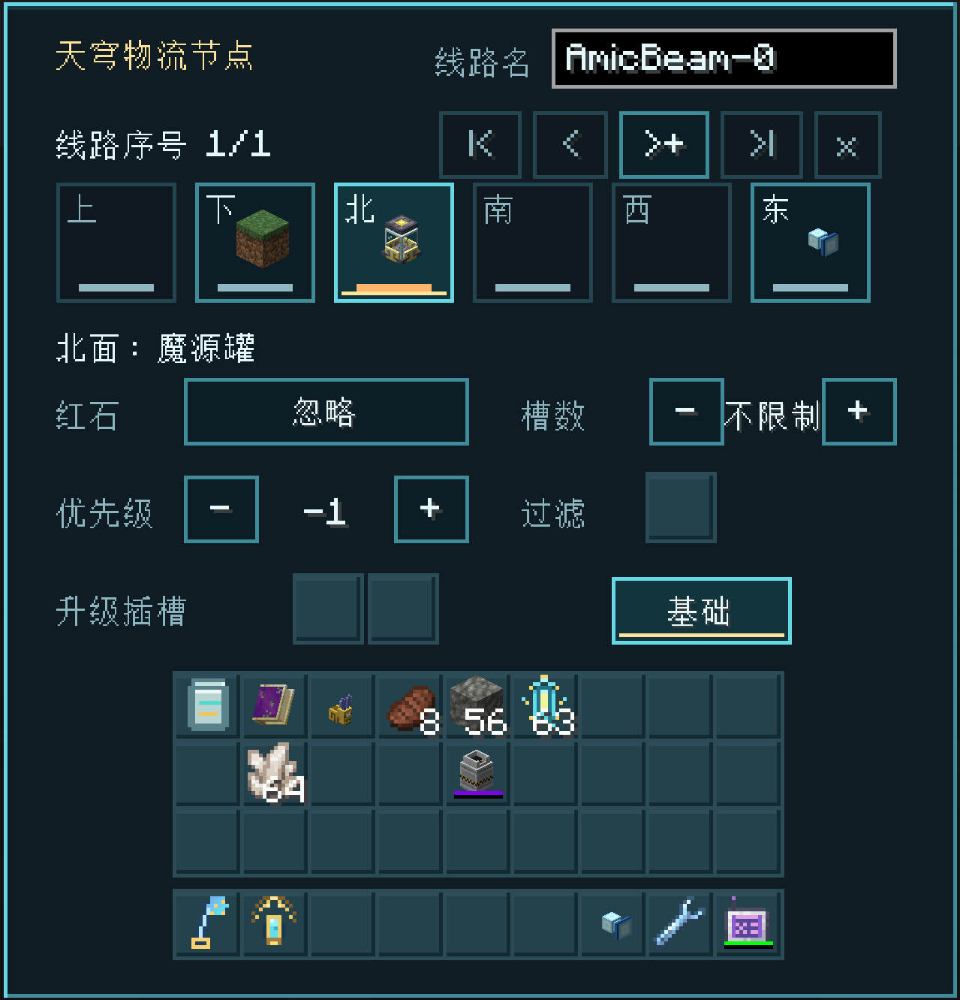
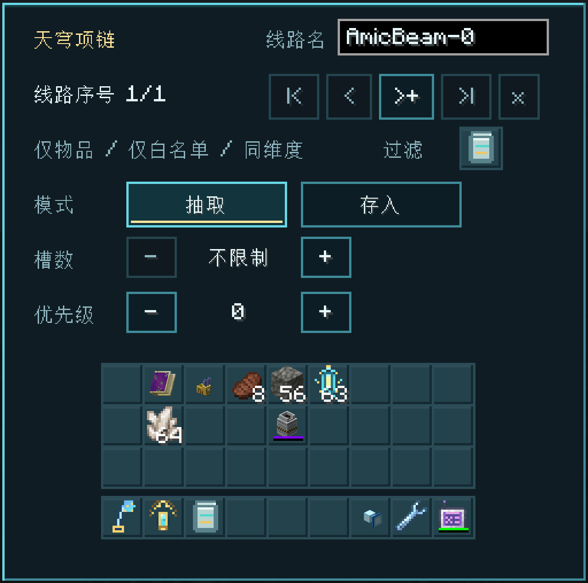
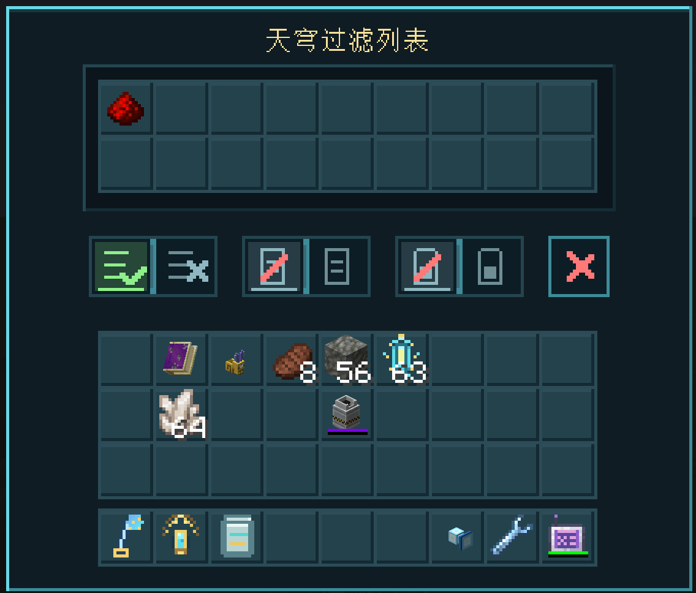
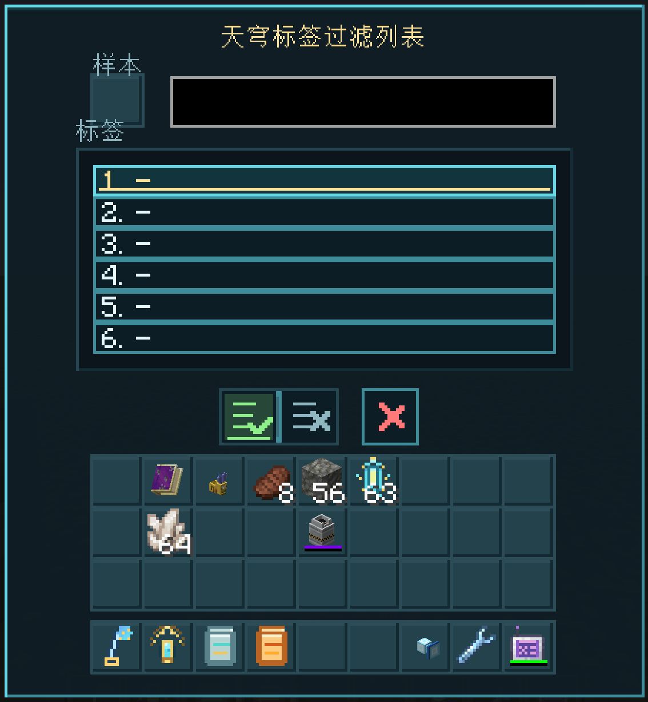
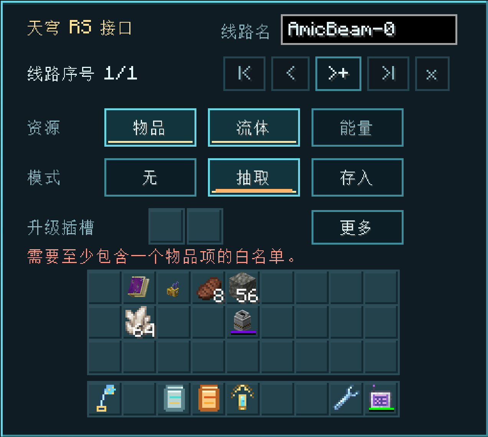
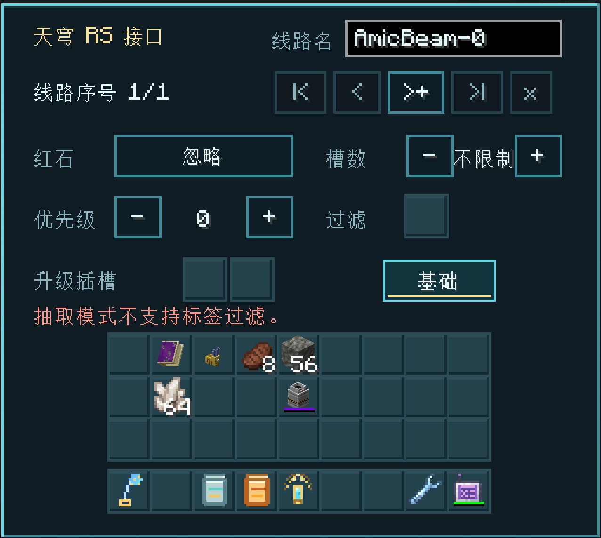
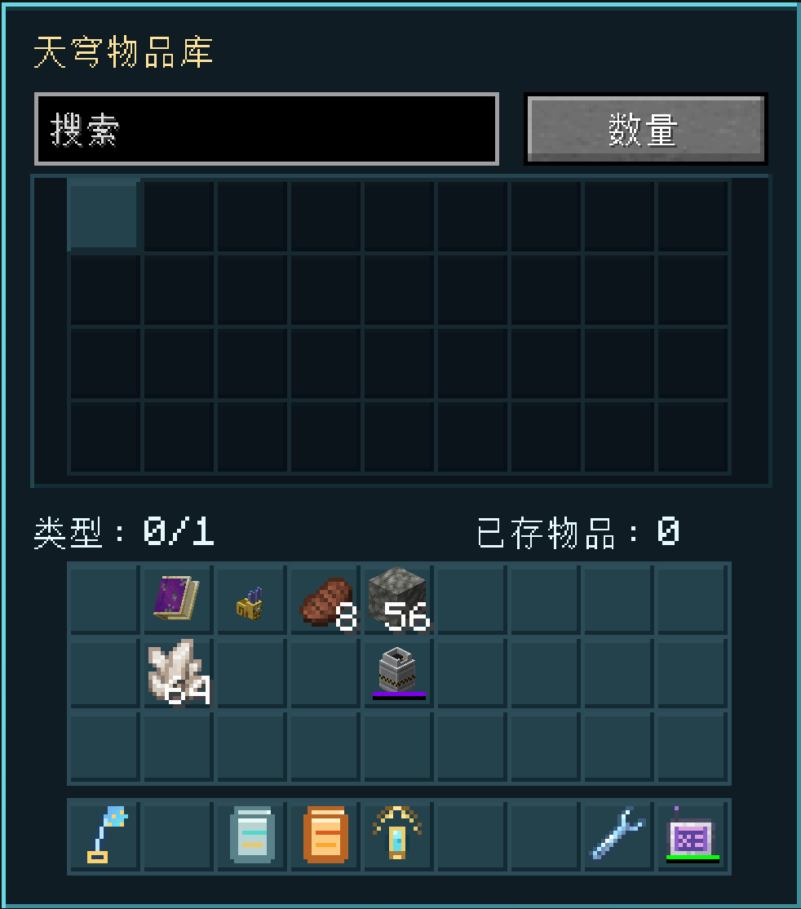
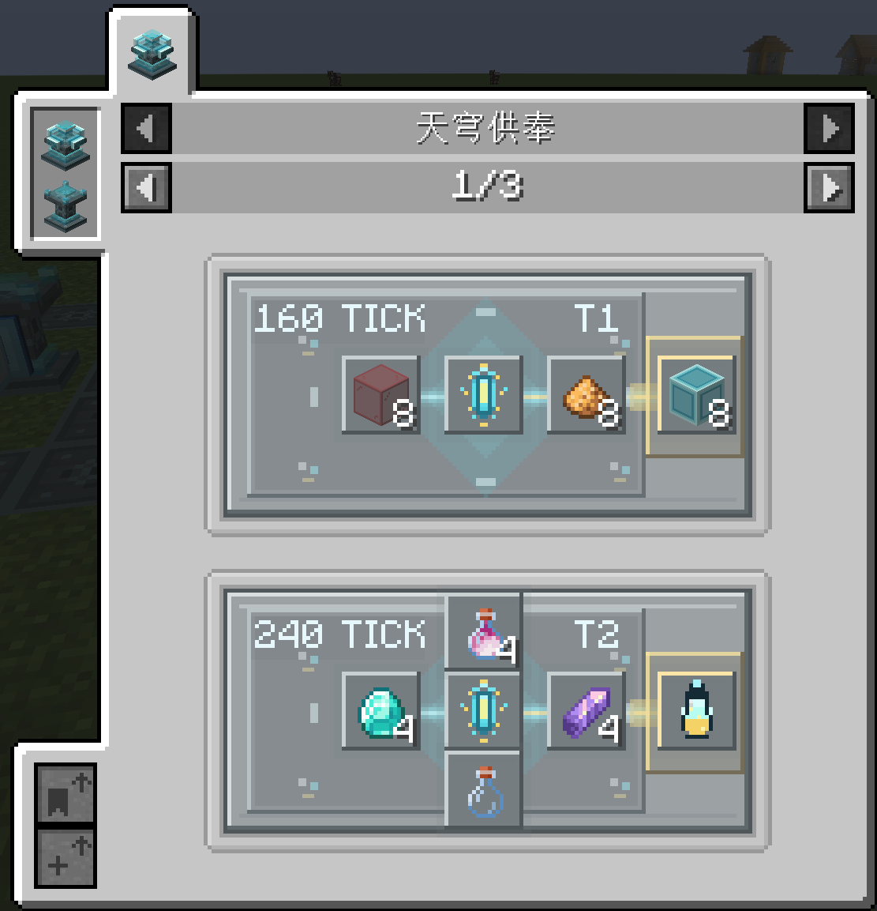

# GUI 功能指南

本页按实际游戏界面介绍天穹物流的全部主要 GUI。截图来自项目的[天穹物流 UI 设计文档](https://www.kdocs.cn/l/crdH1d146lq2)，文字与当前三个受支持版本的对应功能保持一致；不同 Minecraft 版本的字体、物品栏内容或少量按钮位置可能略有差别。

## 通用线路栏

配置器、物流节点、天穹项链和外部接口顶部共用线路管理栏：

| 控件 | 功能 |
| --- | --- |
| `线路名` | 显示并重命名当前线路，最多 48 个字符；失去焦点或按 Enter 后提交 |
| `|<` | 跳到第一条线路 |
| `<` | 切换到上一条线路 |
| `>+` | 切换到下一条线路；位于最后一条时创建新线路 |
| `>|` | 跳到最后一条线路 |
| `×` | 移除当前工具或设备对这条线路的引用；不会删除其它设备 |

`线路序号 1/1` 表示当前位于第几条可用线路。线路名是显示名称，内部线路 ID 保持稳定，因此重命名不会让已经连接的设备断线。

## 天穹配置器

配置器界面既是线路管理器，也是当前线路监控器和节点放置预设：

- **节点 / 抽取 / 存入**：统计当前已加载的连接面数量。
- **线路连接面**：列出设备图标、抽取/存入模式、资源缩写、优先级、红石状态、坐标与维度；顺序与网络顺位一致（来源在前、接收端在后，各组优先级从高到低，同级稳定排序），右上角显示当前页码。
- **物品 / 流体 / 能量 / 自动检测**：决定用副手配置器放置节点时启用哪些资源。自动检测会根据相邻设备能力选择。
- **红石**：选择放置预设的红石控制方式。
- **槽数**：设置物品抽取时在来源槽位中保留的数量；`不限制` 为 0。
- **优先级**：设置目标选择顺序，数值较高的存入端优先。

手持配置器潜行右击节点会复制其设置并进入粘贴模式；之后普通右击其它节点即可应用。打开此 GUI、换掉配置器或再次潜行右击会退出粘贴模式。

## 天穹物流节点：面与资源

节点首页围绕“一个方向就是一个独立端点”设计：

1. 顶部六个方向按钮选择要编辑的面，按钮内的方块图标表示该面相邻设备。
2. **资源**可多选物品、流体和能量。
3. **模式**选择无、抽取或存入。
4. 两个**升级插槽**可安装速度升级、维度升级、强制抽取升级或顺序匹配升级。
5. **更多**进入该面的红石、维持数、优先级和过滤设置。

方向下方会显示当前相邻目标名称。未连接的面不会参与线路传输。

顺序匹配升级的逐槽模式可装在抽取端或存入端；逐个模式仅对抽取端生效，装在存入端时回退为普通存入。手持右击空气切换逐槽/逐个，默认逐槽；切到逐个会清除顺位偏移，再切回逐槽时为 0。逐槽使用“本地槽位 + 顺位偏移 = 网络顺位”：潜行上滚增大、下滚减小，正数跳过网络列表前端，负数跳过本地前端槽位，滚动不会切换快捷栏；抽取端映射接收端，存入端反向映射来源端与本地槽位。逐个在抽取端轮询接收端，成功后正常推进；来源无可传输物品且扣押队列为空时，游标额外归零。来源数量较大时会批量分给多个端点，每个端点分别占用预算；预算不足会缓存原批次并于后续 tick 续传。同优先级节点不会合并。逐个抽取失败会进入持久化扣押队列并优先重试，队列满后停止越过新失败目标。

## 天穹物流节点：高级设置

- **红石**：抽取模式可在忽略信号、有信号时工作、无信号时工作、上升沿脉冲触发四种条件间循环；存入模式会跳过脉冲，已有脉冲配置会自动改为忽略。
- **维持数**：直接输入目标值；右侧按钮在“槽”和“个”之间切换，默认为“槽”。“槽”按匹配物品占用的槽位数工作，“个”按匹配物品总数工作；每个方向独立保存设置。
- **优先级**：高优先级目标先接收；抽取端也可用优先级影响调度。
- **过滤**：该面使用的过滤规则快照。
- **升级插槽**：与基础页显示同一组实际槽位。
- **基础**：返回面与资源页面。

界面底部的红色提示会说明当前组合为什么无效。例如从外部网络抽取物品时，必须至少提供一个物品白名单；抽取模式不支持标签过滤的场景也会直接提示。

## 天穹项链

项链使用物品白名单在所选线路与玩家侧之间搬运物品：

- **过滤槽**：必须放入至少包含一个物品项的白名单过滤列表；黑名单不会工作。
- **抽取**：从玩家或兼容背包取出匹配物品并发送到线路。
- **存入**：从线路来源取得匹配物品并放入玩家或兼容背包。
- **维持**：以玩家主物品栏中的匹配库存为目标，数量不足时从线路补入，超出时把多余物品发送到线路；项链界面中与其它模式使用相同文字颜色，在配置器线路列表中显示为紫色。
- **优先级**：决定项链作为线路端点时的顺序。
- **升级插槽**：两个槽位可安装维度升级；同种升级不能重复安装。
- **维度升级**：让项链访问其它已加载维度中的同线路端点。
- **维持数**：直接输入目标值；右侧按钮在“槽”和“个”之间切换，默认为“槽”。选择“槽”时按匹配物品占用的槽位数工作，选择“个”时按匹配物品总数工作。

安装 Curios 时可把项链放入饰品栏；未安装时项链仍可在玩家主物品栏中工作。

## 天穹过滤列表

上方 18 个幽灵槽可保存精确物品和流体样本；在 1.20.1 Forge 和 1.21.1 NeoForge 的 Mekanism 联动中也可保存化学品样本。它们只保存规则，不真实吞掉资源：

| 按钮组 | 左侧 | 右侧 |
| --- | --- | --- |
| 列表模式 | 白名单 | 黑名单 |
| 数据模式 | 匹配 NBT/组件 | 忽略 NBT/组件 |
| 耐久模式 | 匹配耐久 | 忽略耐久 |

右侧红色 `×` 清空全部幽灵槽。可以从玩家物品栏点击物品样本，也可以从 JEI 拖入物品或流体 ghost；水桶从玩家物品栏点击时按物品记录，流体规则可直接从 JEI 对应条目拖入。在上述 Mekanism 联动环境中，化学品 ghost 也能以同样方式拖入，其规则会在化学品转运的来源抽取和目标存入两侧生效。

## 天穹标签过滤列表

标签过滤器按物品标签匹配整类内容：

1. 在**样本**槽放入或拖入一个物品。
2. 点击标签输入框，从该物品拥有的标签下拉列表中选择。
3. 最多保存 6 个标签，可滚动下拉列表并逐条编辑。
4. 底部切换白名单或黑名单，红色 `×` 清空规则。

它适合统一匹配矿锭、木板等跨模组材料。需要精确物品、流体或 NBT/组件判断时改用普通过滤列表。

## 天穹模组过滤列表

模组过滤列表沿用标签过滤列表的六行编辑布局。点击一行后，可在顶部搜索已安装的模组 ID、从建议中选择，或直接手工编辑 ID；规则可切换白名单或黑名单。

过滤始终针对正在传输的资源：物品按物品 ID 的命名空间、流体按流体 ID 的命名空间、化学品按化学品 ID 的命名空间匹配。FE 没有注册表 ID，三个支持版本统一使用虚拟模组 ID `forge`。因此白名单加入 `forge` 会允许 FE，黑名单加入 `forge` 会阻止 FE。

## 外部网络接口

AE2、精致存储和 Beyond Dimensions 接口共用相同布局，标题会显示当前接口类型：

- 选择要暴露给天穹线路的资源类型。
- 模式可设为无、抽取或存入。
- 两个升级槽与节点一致。
- **更多**进入红石、维持数、优先级和过滤设置。

从大型外部网络抽取物品时必须配置至少包含一个可枚举物品项的白名单，避免无界扫描整个网络；标签和模组过滤列表不能作为这种抽取面的物品白名单。

高级页与节点高级页一致，但会根据外部网络能力限制无效组合。服务器也能分别关闭 AE2、RS 或 Beyond Dimensions 的物品、流体、能量及附属资源联动。

## 天穹物品库

- **搜索**：按物品显示名过滤。
- **排序**：按钮依次循环数量、名称、MOD。
- **资源网格**：显示每种物品及其完整 `long` 数量；鼠标悬停可查看完整数值。
- **类型 / 已存物品**：显示已用类型、类型上限和总物品数。
- **滚轮**：内容超过当前页时，在网格上滚动。
- **取出**：空手左击取出一组，右击取出 1 个；按住 Shift 会直接送入玩家背包。
- **存入**：光标拿着物品时左击网格存入整组，右击存入 1 个。

用柯拉甘露右击仓库可增加一个类型槽，不是在 GUI 内扩容。

## 天穹流体库

搜索、排序、滚动和类型统计与物品库一致，数量单位为 mB。光标必须拿着具有流体能力的容器：

- 容器中有流体时，点击网格会优先把容器流体存入仓库。
- 容器可接收流体且点击了某个流体条目时，会从仓库灌装该容器。
- 空手点击只用于查看，不会凭空取出流体。

## JEI 天穹供奉页面

安装 JEI 兼容后，`天穹供奉`分类按配方显示：

- 左上角显示仪式持续时间（tick）。
- `T1` / `T2` 表示所需祭坛等级。
- 中央是祭坛主材料，周围是供桌供品，右侧是产物。
- 左右箭头切换同一产物或分类中的其它配方。

界面仅展示配方；实际仪式仍需达到高度要求并搭建对应等级法阵。
