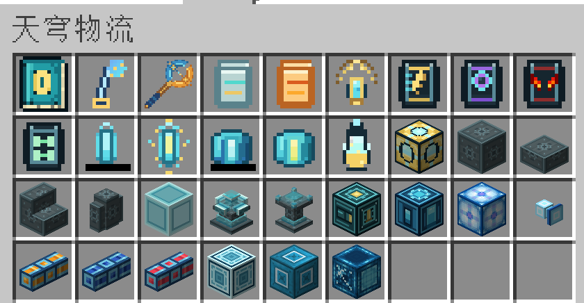

# 天穹物流 Wiki

欢迎来到 **Sky Logistics / 天穹物流** Wiki。本 Wiki 面向玩家，适用于仓库当前维护的 Minecraft 1.20.1、1.21.1 和 26.1.2 版本。

天穹物流提供两套运输方式：

- **无线物流线路**：给抽取端和存入端选择相同线路，即可直接搬运物品、流体、FE 及受支持的第三方资源。
- **简易管道**：铺设相邻管道形成局部网络，适合短距离运输。

两套系统都没有隐藏的中间缓存。目标无法接收时，资源会留在来源中。

## 从这里开始

1. 阅读 [[快速入门]]，完成第一条线路。
2. 在 [[方块图鉴]] 和 [[物品图鉴]] 中查找每个注册内容的用途与操作方式。
3. 打开 [[GUI 功能指南|GUI-功能指南]]，对照截图了解每个按钮和交互。
4. 需要理解线路、优先级、过滤和跨维度传输时，阅读 [[无线物流网络]]。
5. 需要搭建祭坛或制作柯拉甘露时，阅读 [[供奉系统]]。
6. 服务器管理员可查阅 [[配置说明]]。

## 内容索引

| 页面 | 内容 |
| --- | --- |
| [[快速入门]] | 安装后的推荐推进路线和第一条物流线路 |
| [[方块图鉴]] | 全部 17 种方块逐项说明 |
| [[物品图鉴]] | 全部工具、过滤器、升级、材料和手册逐项说明 |
| [GUI 功能指南](GUI-功能指南) | 配置器、节点、项链、过滤器、接口、仓库和 JEI 的逐界面图解 |
| [[无线物流网络]] | 线路、面配置、资源类型、过滤、优先级和红石控制 |
| [[简易管道]] | 三种管道的连接、模式、[AStages 速率联动](AStages联动)和规模限制 |
| [[供奉系统]] | 水晶充能、一阶/二阶法阵和供奉配方 |
| [[联动与版本差异]] | AE2、精致存储、Beyond Dimensions 等联动及版本差异 |
| [[外部网络接口]] | ME、RS、Beyond Dimensions 三种接口的统一说明 |
| [AStages 联动](AStages联动) | 按线路持有者 stage 分别限制并解锁各资源的单次搬运量，1.21.1 包含坚守者灵魂 |
| [[配置说明]] | 常用服务端配置与默认值 |
| [[常见问题]] | 不工作、无法跨维度、管道断开等排查方法 |

## 支持版本

| Minecraft | 加载器 | 游戏内手册 |
| --- | --- | --- |
| 1.20.1 | Forge 47.x | Patchouli 优先，GuideME 回退 |
| 1.21.1 | NeoForge 21.1+ | Patchouli 优先，GuideME 回退 |
| 26.1.2 | NeoForge 26.1.2.71+ | Patchouli 优先，GuideME 回退 |

> 配方可能被整合包或数据包修改。Wiki 解释默认配方和功能，游戏内以 JEI/配方书显示为准。
