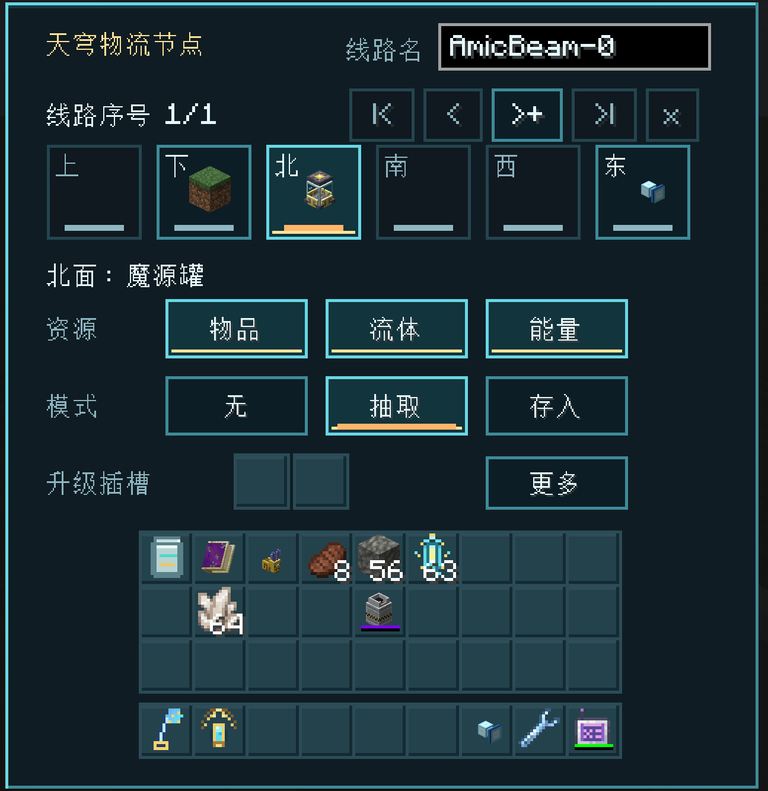
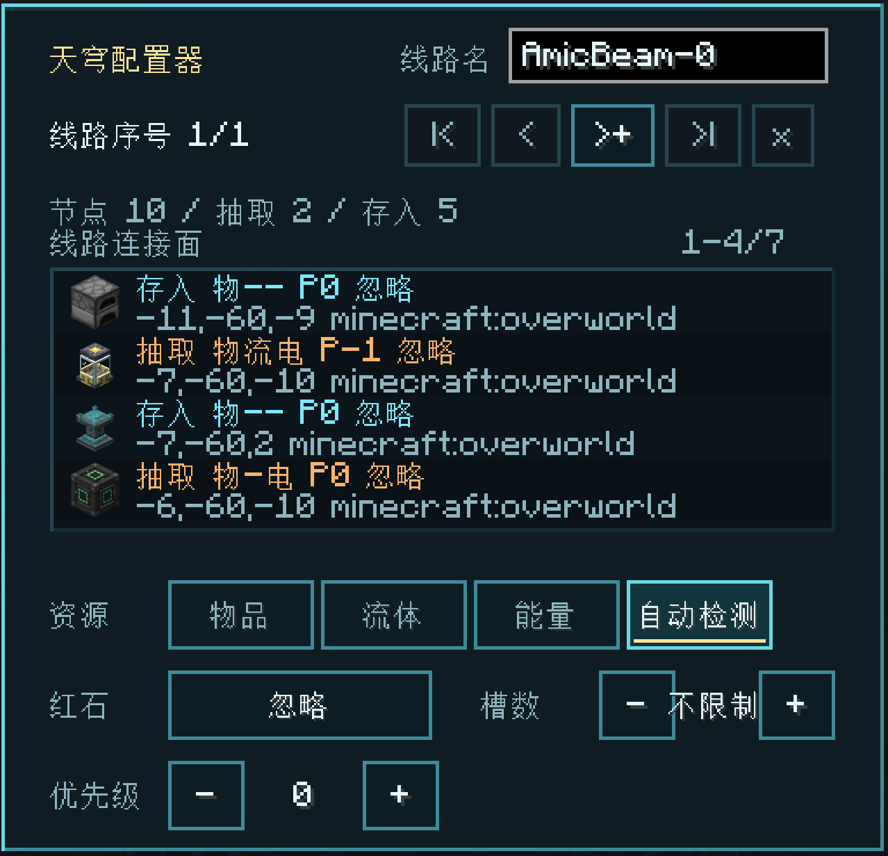

# 无线物流网络

## 基本模型

每条线路由稳定的线路 ID 标识，并拥有可修改的显示名。同名线路会继续指向原线路；节点只有在所在维度和区块已加载时才参与工作。

节点不存储资源。一次传输会先模拟目标是否能够接收，确认后才从来源抽取并提交到目标，因此目标满载或拒收时不会把资源困在“线路中”。

## 节点面配置

每个节点的六个方向可独立设置：

- **断开**：该面不访问相邻方块。
- **抽取**：从相邻方块获取资源并发送到线路。
- **存入**：接收线路资源并插入相邻方块。

每面可独立启用物品、流体、能量。安装相关模组与启用服务器开关后，流体开关也可处理 Mekanism 化学品，能量开关也可处理 Botania mana 或 Ars Nouveau Source；不同体系之间不会互相转换。

## 过滤器

每个面最多有两个过滤升级槽。节点保存的是过滤规则快照，不是真实过滤器物品：

- 天穹过滤列表支持精确物品、流体、白/黑名单、NBT/组件与耐久匹配。在 1.20.1 Forge 和 1.21.1 NeoForge 的 Mekanism 联动中，化学品也可从 JEI 拖入幽灵槽，规则会同时作用于化学品来源和目标。
- 天穹标签过滤列表按物品标签匹配一组内容。
- 某资源类型没有对应过滤条目时，不会被其它类型的条目误伤。例如只有物品条目的过滤器不会阻止流体。

## 优先级与保留数量

每种资源各自维护一套来源端和接收端顺位：物品、流体、FE、化学品、Mana、魔源互不混用。顺位先按优先级从高到低排列，再以维度、节点坐标和方向稳定排序；同优先级端点仍各占一个位置。列表只取决于端点是否启用该资源，不会因库存已满或过滤内容而增删。天穹配置器中的连接面使用同一总顺序显示，各资源列表都是该顺序的对应资源子集。

高优先级存入面先被尝试。抽取面可配置槽位保留数量，避免把机器工作槽完全抽空；值为 0 表示不限制。服务器配置 `maxItemSlotLimit` 控制界面允许设置的最大值。

当存入面连接天穹分配器时，维持条件由节点随插入请求交给分配器计算，而不是先按分配器的扁平虚拟槽粗略放行整批物品。分配器返回本次严格可接受数量，节点据此传输，执行时分配器复用同一计划。均分模式会让每个实际可接收该物品的绑定容器分别维持配置值；红石顺序模式则让全部绑定容器累计维持配置值。若存入面安装逐槽匹配升级，均分模式把匹配位置与 offset（包括负 offset）应用到每台设备的本地槽，顺序模式把所得槽位号解释为绑定设备序号。

## 红石控制

每个面可独立设置四种红石条件：

- **忽略**：无论有无红石信号都工作。
- **有信号**：只有收到红石信号时工作。
- **无信号**：只有没有红石信号时工作。
- **脉冲**：仅抽取面可选。红石信号从无到有时触发扫描，成功搬运一次后休眠，等待下一次上升沿；切换为存入面时自动改为忽略信号。

被红石暂停的端点不会被当成失败目标，因此不会制造无意义的重试压力。

## 升级

- **槽位并行升级**：每张升级让节点每 tick 多扫描 1 个槽位；同一升级格默认最多堆叠 8 张，使节点从 1 槽/t 提升到 9 槽/t。它提高操作频率；[[AStages 联动|AStages联动]]限制的是每次操作的搬运量，两者相互独立。
- **维度升级**：只装在抽取端，允许它向其它已加载维度的同线路目标发送资源。
- **顺序匹配升级**：逐槽可装在物品抽取端或存入端；逐个仅对抽取端生效，装在存入端时回退为普通存入。手持右击空气切换逐槽/逐个，默认逐槽。从逐槽切到逐个时会清除顺位偏移，再切回逐槽时偏移为 0。逐槽采用关系“本地槽位 + 顺位偏移 = 网络顺位”：正数跳过优先级列表前端（偏移 2 时槽 0 对应顺位 2），负数跳过本地前端槽位（偏移 -2 时槽 2 对应顺位 0）。潜行上滚增大、下滚减小，滚动时不会切换快捷栏。抽取端据此选择接收端，存入端反向据此选择库存槽。逐个模式在抽取端轮询接收端，成功后正常推进；来源无可传输物品且扣押队列为空时，游标额外归零。批量访问多个接收端时分别消耗预算；预算不足会缓存原批次并在后续 tick 续传，不重新规划剩余物品。失败分配会加入按抽取面持久化的单物品扣押队列并优先重试，默认队列长度为 1；顺位偏移仅在逐槽生效。

跨维度功能不负责加载维度或区块。

## 天穹项链

天穹项链把玩家主物品栏和兼容背包接入所选线路，并使用物品白名单限定参与转运的内容。它提供三种模式：

- **抽取**：把玩家侧匹配物品发送到线路目标。
- **存入**：从线路来源取得匹配物品并放入玩家侧。
- **维持**：以玩家主物品栏为目标维持匹配库存；低于配置值时从线路补入，高于配置值时将多余部分发往线路。维持模式在配置器中显示为紫色，使用时需要有效物品白名单和大于 0 的维持目标；目标可在“槽”和“个”之间切换，默认按槽位数计算。按槽维持时默认会填满已有匹配槽，但不会新开超出目标数量的槽；可通过 `transfers.fillMaintainedItemSlots` 关闭。

项链的升级槽可安装维度升级，让项链访问其它已加载维度中的同线路端点。维持数直接通过输入框设置，右侧按钮在物品数量“个”和槽位数量“槽”之间切换。

## Jade 状态

安装 Jade 后，查看天穹物流节点会看到单独的“状态”一行。“正在传输”表示节点近期完成过资源搬运，“空闲”表示近期没有完成传输；同一信息区也会汇总节点安装的升级。

## 配置器工作流

1. 右击空气打开配置器并选择线路。
2. 潜行右击一个完成配置的节点，复制设置并进入粘贴模式。
3. 普通右击其它节点批量粘贴。
4. 打开配置器界面、切换手持物品或再次潜行右击会退出粘贴模式。

副手持配置器放置节点可直接应用当前预设，适合批量铺设。

所有按钮和高级页面的逐项解释参见 [[GUI 功能指南|GUI-功能指南]]。
